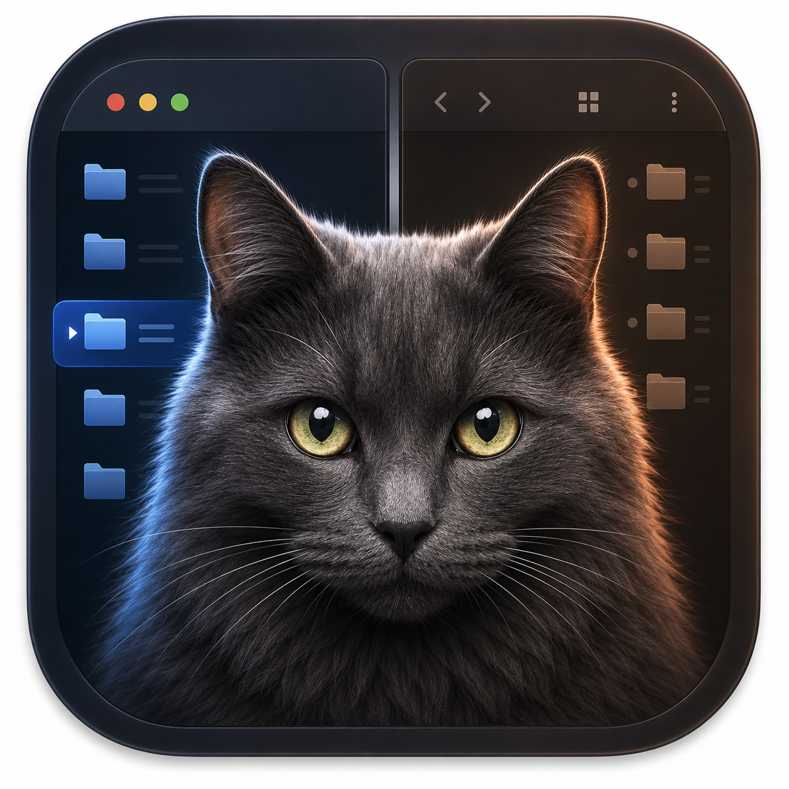

# PulseFiles

PulseFiles is a native, keyboard-first macOS file manager built with AppKit. It combines two independently navigable file panes, predictable file operations, fast keyboard commands, and native macOS integration in a focused alternative to Finder for people who prefer an orthodox dual-pane workflow.

## Development status

> [!WARNING]
> PulseFiles **1.0.0-beta.1** is a testing prerelease, not a production-ready
> 1.0 release. Signed-app validation and the storage-provider compatibility
> matrix are incomplete. Use the beta only with backed-up, non-critical data;
> general 1.0 availability requires the evidence and sign-off in the
> [release checklist](RELEASE_CHECKLIST.md).

## Preview

<p align="center">
  
</p>

The repository-owned app icon above ships with PulseFiles. Runnable debug and release bundles can be produced locally using the instructions below.

## Features

- Native AppKit interface with independent dual-pane navigation and per-pane tabs.
- Folder-first sortable file lists, breadcrumbs, search, hidden-file control, and multiple selection.
- Keyboard-driven copy, move, rename, trash, delete, folder creation, preview, and navigation.
- Conflict-aware, cancellable file operations with preflight checks and progress reporting.
- Sidebar shortcuts and recent locations, Quick Look, and a read-only text/hex viewer.
- Optional single-pane layout and an explicitly opt-in experimental terminal.

## System requirements

- macOS 13 Ventura or later.
- Swift 5.9 or later.
- Xcode or compatible Apple command-line developer tools.

## Install and launch

PulseFiles does not yet provide a generally available, production-ready 1.0
release. The 1.0.0-beta.1 source can be built for evaluation:

```sh
git clone https://github.com/deemoun/PulseFiles.git
cd PulseFiles
./scripts/build_app.sh
open artifacts/PulseFiles.app
```

To build and launch in one step, run `./scripts/build_app.sh --run`. The debug
bundle is written to `artifacts/PulseFiles.app`. For a local optimized but
unsigned beta build, run `./scripts/build_release_app.sh --local-unsigned`; its
development-only bundle is isolated at
`artifacts/development/unsigned-release/PulseFiles.app`. Neither locally built
bundle is a production-ready release. Distributable packaging and the checks
required for general 1.0 availability are documented in the
[release checklist](RELEASE_CHECKLIST.md), including its licensing and source
distribution gate. Signing and notarization are only part of that gate and do
not by themselves make an archive ready for open-source distribution.

## License and corresponding source

PulseFiles is free software licensed under **GPL-3.0-or-later** and is provided
without warranty; see [`LICENSE`](LICENSE) and [`NOTICE`](NOTICE). Downloadable
binary releases use the GPLv3 section 6(d) mechanism: the object code is offered
from a designated download location with equivalent network access, at no
additional charge, to the Corresponding Source.

For each downloadable binary, the release page at
<https://github.com/deemoun/PulseFiles/releases> identifies its permanent,
signed version tag. Recipients obtain the exact Corresponding Source by
downloading the source archive for that same tag (or by cloning the repository
and checking out that tag), rather than using the moving `main` branch. The
archive includes the build and packaging scripts needed to produce the release.
The tagged source remains available alongside the binary for as long as the
binary is offered.

## Keyboard shortcuts

| Shortcut | Action |
| --- | --- |
| Tab | Switch the active pane |
| Return | Open the selected item, or confirm an edit |
| F3 | Open the selected file in the read-only text/hex viewer |
| F4 | Open the selected item normally |
| F5 / F6 | Copy / move the selection to the opposite pane |
| F7 / Shift-F7 | Create a folder / file |
| F8 / Shift-Delete | Move the selection to Trash |
| Space | Preview the selected item with Quick Look |
| Backspace / Command-Up | Navigate to the parent folder |
| Command-[ / Command-] | Navigate back / forward |
| Command-Shift-G | Go to a folder |
| Command-N / Command-Shift-N | Create a folder / file |
| Command-C / Command-X / Command-V | Copy / cut / paste |
| Command-Shift-. | Show or hide hidden files |
| Control-Command-1…7 | Sort by name, extension, kind, size, modified, created, or added date |
| Command-` | Toggle the Experimental Terminal after enabling it in Settings |
| Command-Period | Cancel the active file operation |
| Command-T / Command-W | Create / close a tab in the active pane |
| Control-Tab / Control-Shift-Tab | Select the next / previous tab in the active pane |
| Option-Command-\\ | Toggle single- and dual-pane layout |

The eighth sort criterion, **Accessed**, is available through menus and table headers but has no numbered shortcut.

## Safety model

### DEBUG experimental sandbox

Release builds use normal file-manager access, subject to macOS permissions and explicit folder grants. DEBUG builds can opt into a cautious restriction with `--pulsefiles-enable-experimental-sandbox`; while enabled, browsing and file operations remain under `~/Library/Application Support/PulseFiles/ExperimentalSandbox` unless access to another folder is explicitly granted. Access continues to route through the app's sandbox access policy in every build.

### Destructive operations

Copy, move, rename, trash, and permanent-delete operations are preflighted before mutation. PulseFiles validates sources and destinations, prompts for conflicts and configured confirmations, supports cancellation, and reports partial failures; nevertheless, test development builds only with backed-up, disposable data.

### Opt-in terminal

The Experimental Terminal is disabled and hidden by default. It must be enabled in Settings and shows a first-use warning. Once acknowledged, opening the panel starts one persistent interactive shell in the active pane's authorized folder; standard navigation keys, selection/copy, paste, and Option-key shell shortcuts are forwarded with terminal semantics. The terminal is not a security boundary: commands can modify or delete any files that macOS permits the app to access. Closing the panel terminates the shell on a best-effort basis and cannot roll back commands that already ran.

Implementation details for these boundaries are in the [architecture and maintenance guide](DOCUMENTATION.md#filesystem-access-and-safety), and release scenarios are in the [release checklist](RELEASE_CHECKLIST.md).

## Version 1.0 storage compatibility

The 1.0.0-beta.1 release does **not** claim verified support for the storage
providers and special item classes below. These are implementation expectations
to test with disposable fixtures, not a compatibility promise. General 1.0
support claims must be limited to scenarios with signed-app evidence in the
[release checklist](RELEASE_CHECKLIST.md).

| Item class | Beta status | Behavior to test; not verified support |
| --- | --- | --- |
| iCloud Drive and cloud-provider folders | Unverified in beta | Test whether macOS access checks permit browsing and operations. A cloud-only iCloud item is expected to be rejected before mutation; download it in Finder and retry. Provider sync conflicts, provider-specific metadata, and providers without normal file semantics are not supported claims. |
| Network shares and removable media | Unverified in beta | Test preflight and availability changes using disposable data. Reconnect or remount an unavailable volume before retrying. Do not infer support for a provider or device from the implementation. |
| Packages | Unverified in beta | Test copies and moves only with disposable package fixtures. Application-specific package integrity is not guaranteed. |
| Symbolic links | Unverified in beta | Test whether copy preserves the stored link destination without traversing its target. Do not use links to important external targets while validation is pending. |
| Finder aliases | Mutation unsupported | Use Finder to manage an alias or operate on its original item; beta testing expects PulseFiles to reject mutation and leave the alias unchanged. |
| Metadata preservation | Unverified, best-effort beta behavior | Test POSIX permissions, permitted ownership IDs, timestamps, Finder tags and labels, extended attributes, and ACLs. Verify destination metadata before removing any source; provider-specific metadata is not promised. |

A successful content transfer does not guarantee preservation of cloud-provider state, custom metadata, or application-specific package internals.

## Development quick start

Run these commands from the repository root:

```sh
# Validate package-layer and filesystem-mutation boundaries
./scripts/validate_architecture.sh

# All four SwiftPM test targets
swift test

# Package a local debug app at artifacts/PulseFiles.app
./scripts/build_app.sh

# Package an unsigned local optimized app (development only)
./scripts/build_release_app.sh --local-unsigned

# Build a signed/notarized release candidate; distribution also requires the licensing gate
PULSEFILES_SIGN_IDENTITY='Developer ID Application: …' \
PULSEFILES_NOTARY_PROFILE='pulsefiles-release' \
./scripts/build_release_app.sh --distribute

# Run the disposable automation entry point
./scripts/run_automation_tests.sh
```

Release operators must complete the [release checklist's licensing and source
distribution gate](RELEASE_CHECKLIST.md#licensing-and-source-distribution-gate)
in addition to signing, notarizing, and validating the candidate archive.

`swift test` runs the complete test suite: AppKit-free core tests
(`PulseFilesCoreTests`), service tests (`PulseFilesServicesTests`), application and
integration tests (`PulseFilesTests`), and in-process AppKit UI tests
(`PulseFilesAppKitUITests`). During a focused development iteration, run the
appropriate narrow command:

```sh
swift test --filter PulseFilesCoreTests
swift test --filter PulseFilesServicesTests
swift test --filter PulseFilesTests
swift test --filter PulseFilesAppKitUITests
```

Filtered commands are development conveniences; they do not replace the full
`swift test` release gate.

On macOS hosts without Accessibility permission, use `./scripts/run_automation_tests.sh --skip-system-events` to retain Swift and in-process AppKit coverage while skipping the external System Events harness. Generated `.build/` and `artifacts/` content must not be committed. Detailed testing, packaging, and release-validation procedures live in [DOCUMENTATION.md](DOCUMENTATION.md#testing-builds-and-agent-checklist) and [RELEASE_CHECKLIST.md](RELEASE_CHECKLIST.md).

## Architecture

PulseFiles is a Swift Package Manager executable organized by responsibility: `App` composes the window and menus; `FilePane`, `Sidebar`, and `Terminal` provide UI surfaces; `Commands` coordinates actions and shortcuts; `Services` owns persistence, access policy, filesystem loading, and operations; and `Models` and `Utilities` contain focused supporting types. See the [PulseFiles Architecture and Maintenance Guide](DOCUMENTATION.md) for the runtime flow and component reference.

## Roadmap

The [V1 release-stage plan](docs/v1-release-plan.md) separates the exit criteria
for beta readiness, a later release candidate, and general 1.0 availability.
The current 1.0.0-beta.1 identity satisfies versioning intent, not those later
validation gates. The [orthodox file-manager feature-gap
audit](docs/orthodox-feature-gap-audit.md) tracks implemented behaviors, future
directions, and explicitly deferred work.

## Contributing, testing, and project policies

- **Contributing:** Read [CONTRIBUTING.md](CONTRIBUTING.md) for issue reporting, development setup, safety constraints, testing, licensing, and pull request guidance. [AGENTS.md](AGENTS.md) remains optional implementation guidance.
- **Testing:** Follow the [development quick start](#development-quick-start) and the detailed [testing guide](DOCUMENTATION.md#testing-builds-and-agent-checklist).
- **Privacy:** PulseFiles does not automatically upload diagnostics; read the [privacy policy](PRIVACY.md) for local data and permission details.
- **Support:** Use [GitHub Issues](https://github.com/deemoun/PulseFiles/issues) for support and [the issue chooser](https://github.com/deemoun/PulseFiles/issues/new/choose) for bug reports and feature requests.
- **License:** PulseFiles is available under **GPL-3.0-or-later** (the [GNU General Public License, version 3 or any later version](LICENSE)); third-party attribution is listed in [NOTICE](NOTICE).
